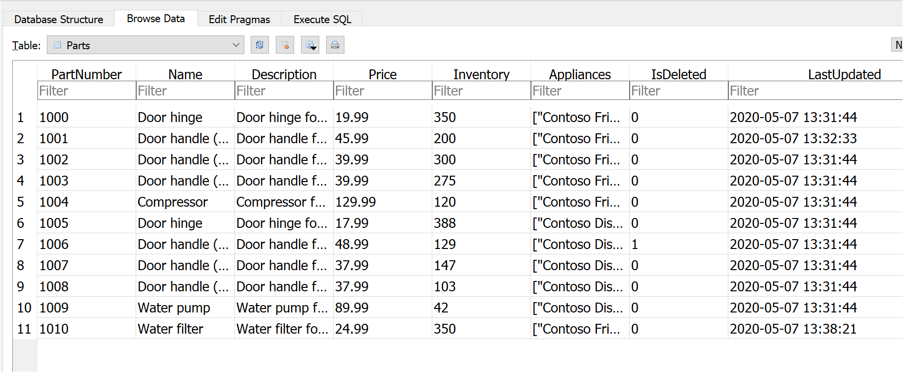

# Microsoft Graph connector Sample

This .NET Core sample application demonstrates how to build a custom [Microsoft Graph connector](https://docs.microsoft.com/en-us/graph/connecting-external-content-connectors-overview) using Microsoft Graph APIs to index items from a sample applicance parts inventory, and have that data appear in [Microsoft Search](https://docs.microsoft.com/en-us/microsoftsearch/) results.

## Prerequisites

- .NET 3.1 SDK
- [Entity Framework Core Tools](https://docs.microsoft.com/ef/core/miscellaneous/cli/dotnet) (`dotnet tool install --global dotnet-ef`)
- Some way to update a SQLite database. For example, the [DB Browser for SQLite](https://sqlitebrowser.org/).

## Register an app in Azure portal

In this step you'll register an application in the Azure AD admin center. This is necessary to authenticate the application to make calls to the Microsoft Graph indexing API.

1. Go to the [Azure Active Directory admin center](https://aad.portal.azure.com/) and sign in with an administrator account.
1. Select **Azure Active Directory** in the left-hand pane, then select **App registrations** under **Manage**.
1. Select **New registration**.
1. Complete the **Register an application** form with the following values, then select **Register**.

    - **Name:** `Parts Inventory Connector`
    - **Supported account types:** `Accounts in this organizational directory only (Microsoft only - Single tenant)`
    - **Redirect URI:** Leave blank

1. On the **Parts Inventory Connector** page, copy the value of **Application (client) ID**, you'll need it in the next section.
1. Copy the value of **Directory (tenant) ID**, you'll need it in the next section.
1. Select **API Permissions** under **Manage**.
1. Select **Add a permission**, then select **Microsoft Graph**.
1. Select **Application permissions**, then select the **ExternalItem.ReadWrite.OwnedBy** permission. Select **Add permissions**.
1. Select **Application permissions**, then select the **ExternalConnection.ReadWrite.OwnedBy** permission. Select **Add permissions**.
1. Select **Grant admin consent for {TENANT}**, then select **Yes** when prompted.
1. Select **Certificates & secrets** under **Manage**, then select **New client secret**.
1. Enter a description and choose an expiration time for the secret, then select **Add**.
1. Copy the new secret, you'll need it in the next section.

## Configure the app

1. Open your command line interface (CLI) in the directory where **PartsInventoryConnector.csproj** is located.
1. Run the following command to initialize [user secrets](https://docs.microsoft.com/aspnet/core/security/app-secrets) for the project.

    ```dotnetcli
    dotnet user-secrets init
    ```

1. Run the following commands to store your app ID, app secret, and tenant ID in the user secret store.

    ```dotnetcli
    dotnet user-secrets set appId "YOUR_APP_ID_HERE"
    dotnet user-secrets set appSecret "YOUR_APP_SECRET_HERE"
    dotnet user-secrets set tenantId "YOUR_TENANT_ID_HERE"
    ```

## Initialize the database

```dotnetcli
dotnet ef database update
```

### Delete and reset database

```dotnetcli
dotnet ef database drop
dotnet ef database update
```

## Run the app

In this step you'll build and run the sample. This will create a new connection, register the schema, then push items from the [ApplianceParts.csv](ApplianceParts.csv) file into the connection.

1. Open your command-line interface (CLI) in the **PartsInventoryConnector** directory.
1. Use the `dotnet build` command to build the sample.
1. Use the `dotnet run` command to run the sample.
1. Select the **1. Create a connection** option. Enter a unique identifier, name, and description for the connection.
1. Select the **4. Register schema for current connection** option. Wait for the operation to complete.

    > **Note:** If this steps results in an error, wait a few minutes and then select the **5. View schema for current connection** option. If a schema is returned, the operation completed successfully. If no schema is returned, you may need to try registering the schema again.

1. Select the **6. Push updated items to current connection** option.

## Create a vertical

Create and enable a search vertical at the organization level following the instructions in [Manage Verticals] (https://docs.microsoft.com/en-us/microsoftsearch/manage-verticals).

- **Name:** Appliance Parts
- **Content source:** the connector created with the app
- **Add a query:** leave blank

## Create a result type

Create a result type at the organization level following the instructions in [Manage Result Types] (https://docs.microsoft.com/en-us/microsoftsearch/manage-result-types).

- **Name:** Appliance Part
- **Content source:** the connector created with the app
- **Rules:** None
- Paste contents of [result-type.json](result-type.json) into layout

## Search for results

In this step you'll search for parts in SharePoint.

1. Go to your root SharePoint site for your tenant.
1. Using the search box at the top of the page, search for `hinge`.
1. When the search completes with 0 results, select the **Appliance Parts** tab.
1. Results from the connector are displayed.

## Updating records in the database

Use your favorite tool to update records in the database. The **Push updated items** menu choice will only push the items you update.

> **NOTE:** Do not delete records from the database. To "delete" an item, set the IsDeleted property to 1.
>
> 
